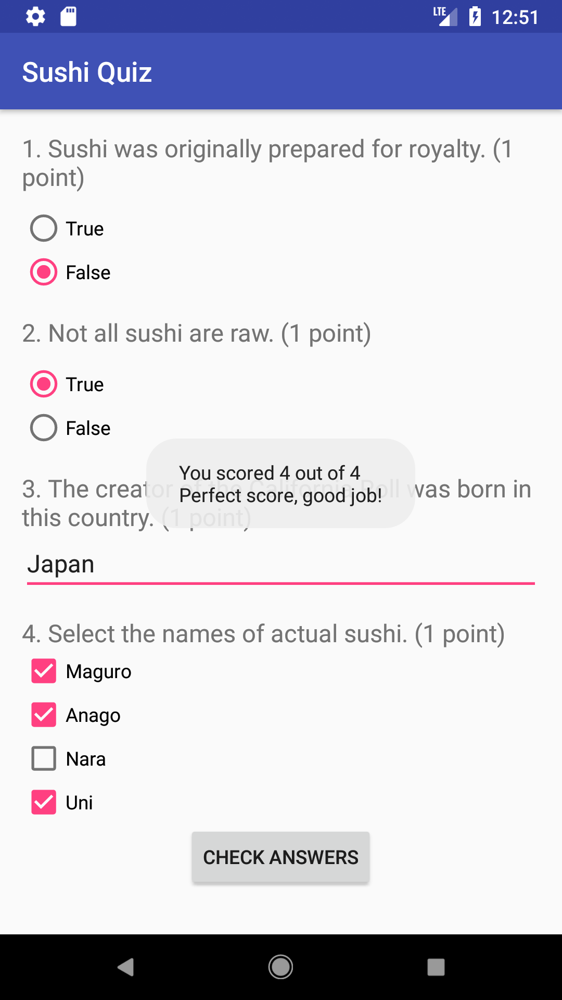

# Sushi-Quiz
Grow With Google Challenge Scholarship: Android Basics (Lesson 12)

A simple quiz app about sushi that consists of radio buttons, check boxes, and a text field. Toast message displays the score once button is tapped.

